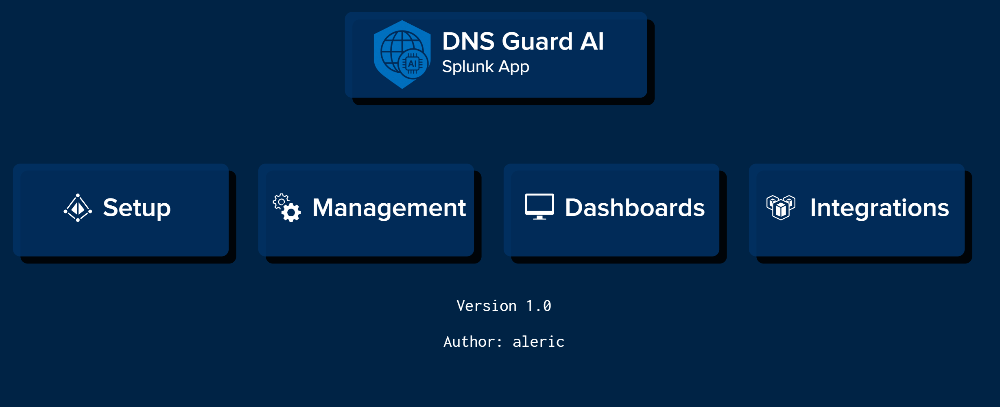
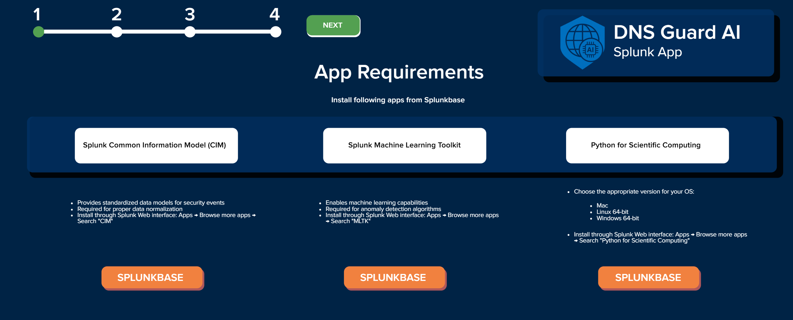
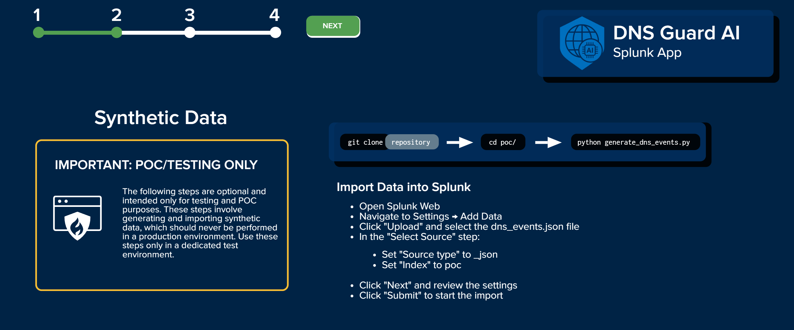
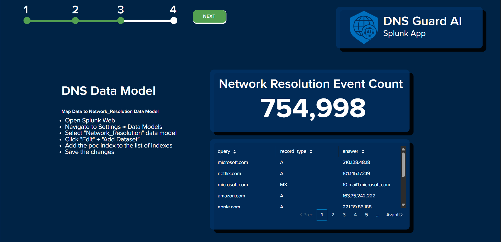

# Splunk DNS Guard AI
A comprehensive DNS anomaly detection system using Splunk and machine learning to identify malicious DNS activity in enterprise networks.

> 🏆 **Splunk Build-a-thon 2025 Entry**  
> This project was developed as part of the [Splunk Build-a-thon 2025](https://www.hackerearth.com/challenges/hackathon/splunk-build-a-thon/#themes) competition, specifically for Track 4: AI/ML. The competition focuses on developing ML-based threat detections inside Splunk using MLTK, bringing data into Splunk and building real-time pipelines to capture threat actors.


<p align="center">
  <a href="#"></a>
  <a href="#"></a>
  <a href="#"></a>
</p>

## 📋 Table of Contents
- [Overview](#overview)
- [Project Structure](#project-structure)
- [Features](#features)
- [Getting Started](#getting-started)
  - [Prerequisites](#prerequisites)
    - [Python Requirements](#-python-requirements)
    - [Splunk Requirements](#-splunk-requirements)
    - [Recommended Additions](#-recommended-additions)
  - [Installation Steps](#installation-steps)
  - [Synthetic Data Details](#synthetic-data-details)
- [Detection Methods Details](#detection-methods-details)
- [System Dashboards](#system-dashboards)
- [Acknowledgments](#acknowledgments)

## Overview

DNS Guard AI is a Splunk App designed to detect various types of DNS anomalies that could indicate malicious activity such as command and control (C2) communication, data exfiltration, or reconnaissance. The system uses Splunk's powerful search capabilities combined with machine learning techniques to identify patterns that deviate from normal DNS behavior.

### Key Benefits

<div align="center">

| 🚀 Feature | 📝 Description |
|------------|---------------|
| **Real-time Detection** | ⚡ Continuous monitoring of DNS traffic for immediate threat identification |
| **Comprehensive Analysis** | 🔍 Multiple detection methods working in concert to identify various types of threats |
| **Machine Learning Integration** | 🤖 Advanced algorithms for pattern recognition and anomaly detection |
| **Enterprise-Ready** | 🏢 Scalable solution designed for large network environments |
| **CIM Compliance** | ✅ Fully compatible with Splunk's Common Information Model |

</div>

## Project Structure

```
├── poc/                       # Contains the Proof of Concept implementation
│   └── generate_dns_events.py # Script to generate synthetic DNS data
├── Splunk-DNSGuard-AI/        # Main application directory
│   ├── default/               # Default configuration files
│   │   ├── app.conf           # App configuration
│   │   ├── collections.conf   # Collections configuration
│   │   ├── macros.conf        # Macros configurations
│   │   ├── risk_factors.conf  # Risk Factors configurations
│   │   └── savedsearches.conf # Saved search configurations
│   │   └── transforms.conf    # Transforms configurations
│   └── static/                # Static resources
│       └── appIcon*           # App icons
```

## Features

| Detection Method                  | DNS Anomaly                             
|-----------------------------------|-----------------------------------------
| Beaconing                         | Detects regular, periodic DNS queries typical of C2 communication
| C2 Tunneling                      | Identifies hosts making an unusually high number of DNS queries         
| Query Length Anomalies            | Identifies unusually long DNS queries (potential data exfiltration)  
| Domain Shadowing                  | Detects many unique subdomains for a legitimate domain  
| TXT Record Anomalies              | Detects unusual use of TXT records for data exfiltration               
| ANY Record Anomalies              | Identifies reconnaissance activity using ANY queries               
| HINFO Record Anomalies            | Identifies reconnaissance activity using HINFO queries              
| AXFR Record Anomalies             | Identifies reconnaissance activity using AXFR queries                
| Behavioral Clustering             | Groups hosts with similar abnormal DNS behavior              


## Getting Started

### Prerequisites

#### 🐍 Python Requirements
- **Python Version**: 3.6 or higher
  - To check your Python version, open a terminal and run:
    ```bash
    python --version
    ```
  - If you need to install Python, download it from [python.org](https://www.python.org/downloads/)
  - During installation, make sure to check "Add Python to PATH"

#### 🔍 Splunk Requirements
- **Splunk Enterprise / Splunk Cloud**: Version 8.0 or higher
  - Download Splunk from [splunk.com](https://www.splunk.com/en_us/download/splunk-enterprise.html)
  - Follow the installation guide for your operating system
  - After installation, access Splunk Web at `http://localhost:8000`

- **Essential Apps**:
  1. [Splunk Common Information Model (CIM)](https://splunkbase.splunk.com/app/1621)
     - Provides standardized data models for security events
     - Required for proper data normalization
     - Install through Splunk Web interface: Apps → Browse more apps → Search "CIM"
  
  2. [Splunk Machine Learning Toolkit](https://splunkbase.splunk.com/app/2890)
     - Enables machine learning capabilities
     - Required for anomaly detection algorithms
     - Install through Splunk Web interface: Apps → Browse more apps → Search "MLTK"
  
  3. **Python for Scientific Computing**:
     - Choose the appropriate version for your OS:
       - [Mac](https://splunkbase.splunk.com/app/2881/)
       - [Linux 64-bit](https://splunkbase.splunk.com/app/2882/)
       - [Windows 64-bit](https://splunkbase.splunk.com/app/2883/)
     - Install through Splunk Web interface: Apps → Browse more apps → Search "Python for Scientific Computing"

#### ⭐ Recommended Additions
- [Splunk Enterprise Security](https://splunkbase.splunk.com/app/263)
  - Provides advanced security monitoring capabilities
  - Includes pre-built security dashboards and alerts
  - Install through Splunk Web interface: Apps → Browse more apps → Search "Enterprise Security"

- [DGA App for Splunk](https://splunkbase.splunk.com/app/3559)
  - Specialized in Domain Generation Algorithm detection and analysis
  - Complements DNSGuard-AI's detection capabilities
  - Install through Splunk Web interface: Apps → Browse more apps → Search "DGA"

### Installation Steps

1. **Prepare Your Environment**
   ```bash
   # Create a new directory for the project
   mkdir Splunk-DNSGuard-AI
   cd Splunk-DNSGuard-AI
   ```

2. **Clone the Repository**
   ```bash
   # Clone the repository
   git clone https://github.com/yourusername/Splunk-DNSGuard-AI.git
   ```

3. **Install Splunk App**
   - Copy the `Splunk-DNSGuard-AI` directory to your Splunk apps directory:
     - Windows: `C:\Program Files\Splunk\etc\apps\`
     - Linux/Mac: `/opt/splunk/etc/apps/`
   - Restart Splunk or reload the app:
     - Open Splunk Web
     - Go to Settings → Apps
     - Find "DNSGuard-AI" and click "Restart"

> ⚠️ **IMPORTANT: POC/TESTING ONLY**  
> The following steps (4-7) are **optional** and intended **only for testing and POC purposes**. These steps involve generating and importing synthetic data, which should **never** be performed in a production environment. Use these steps only in a dedicated test environment.

4. **Generate Test Data**
   ```bash
   # Navigate to the POC directory
   cd poc
   
   # Generate synthetic DNS data
   python generate_dns_events.py
   ```

5. **Import Data into Splunk**

   **Option 1: Using Command Line**
   ```bash
   # Import the generated data
   splunk add oneshot -index poc -sourcetype _json -source dns_events.json
   ```

   **Option 2: Using Splunk Web Interface**
   - Open Splunk Web
   - Navigate to Settings → Add Data
   - Click "Upload" and select the `dns_events.json` file
   - In the "Select Source" step:
     - Set "Source type" to `_json`
     - Set "Index" to `poc`
   - Click "Next" and review the settings
   - Click "Submit" to start the import

6. **Map Data to Network_Resolution Data Model**
   - Open Splunk Web
   - Navigate to Settings → Data Models
   - Select "Network_Resolution" data model
   - Click "Edit" → "Add Dataset"
   - Add the `poc` index to the list of indexes
   - Save the changes

7. **Verify Installation**
   - Open Splunk Web
   - Navigate to the DNS Guard AI dashboard
   - Verify that data is being displayed
   - Check that all detection methods are working

### Synthetic Data Details

The synthetic data generated for testing purposes includes various types of DNS anomalies designed to demonstrate DNSGuard-AI's detection capabilities:

- **Optimized for Detection**: Each anomaly is specifically engineered to trigger the corresponding Splunk detection macro
- **C2 Tunneling**: High volume of DNS queries concentrated in hourly windows to trigger density-based outlier detection
- **Beaconing**: Precisely timed queries with minimal jitter to establish clear communication patterns
- **TXT Record Anomalies**: Suspicious encoded content in TXT records with command-like prefixes
- **ANY/HINFO/AXFR Records**: Targeted use of rare record types for reconnaissance
- **Query Length Anomalies**: Extremely long DNS queries exceeding threshold limits
- **Domain Shadowing**: Large number of unique subdomains for a single parent domain

> ⚠️ **REMINDER**: This synthetic data is for testing purposes only and should never be used in a production environment.

## Detection Methods Details

## System Dashboards

The DNS Guard AI system includes a comprehensive set of dashboards and management interfaces to provide complete visibility and control over the DNS monitoring system:

### Menu



### Setup
1. **App Requirements**



2. **Synthetic Data**



3. **DNS Data Model**



4. **MLTK Configuration**


### Management
1. **Model Training**
2. **Anomaly Detection**
3. **Alerts**
4. **Lookup**


### Dashboards
1. **DNS Anomalies Overview**
   - High-level threat landscape
   - Real-time monitoring
   - Top anomalies summary

2. **Beaconing**
   - Periodic communication patterns
   - Beaconing frequency analysis
   - Suspicious host identification

3. **C2 Tunneling**
   - Command and control detection
   - Tunneling pattern analysis
   - Compromised host identification

4. **Query Length Anomalies**
   - Query size distribution
   - Length threshold monitoring
   - Potential exfiltration detection

5. **Domain Shadowing**
   - Subdomain analysis
   - Domain reputation monitoring
   - Shadow domain detection

6. **Record Type Anomalies**
   - Record type distribution
   - Unusual record type detection
   - Reconnaissance activity monitoring

### Integrations
1. **Enterprise Security**
   - ES correlation rules
   - Security posture integration
   - Incident response workflow

2. **DGA App**
   - Domain Generation Algorithm detection
   - DGA pattern analysis
   - Malicious domain identification

## Acknowledgments

- Optimized to demonstrate Splunk's machine learning capabilities for DNS threat detection
- Uses Splunk's Common Information Model (CIM) for Network Resolution